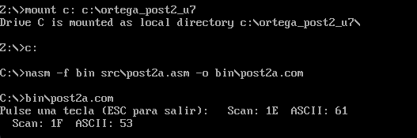
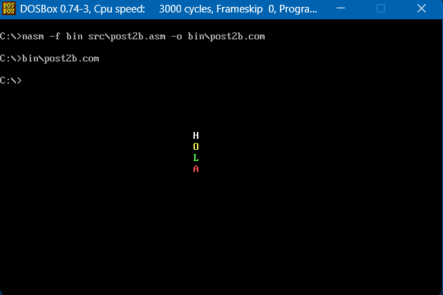

# Laboratorio Unidad 7 - Post-Contenido 2 (Teclado y Video B800h)

## Descripción
Implementación de programas en ensamblador x86 que utilizan INT 16h para la lectura del teclado y acceso directo al segmento de video B800h para manipular texto y color en pantalla.

## Estructura del proyecto
- src/ → código fuente (.asm)
- bin/ → ejecutables (.com)
- capturas/ → evidencias

## Tecnologías
- NASM
- DOSBox

## Evidencias

## 1: Lectura de teclado con INT 16h

Se implementó la lectura de teclas mediante INT 16h, mostrando el scan code y el código ASCII de cada tecla presionada hasta detectar la tecla ESC.

## 2: Escritura directa en memoria de video B800h

Se accedió directamente al segmento B800h para escribir caracteres en pantalla con diferentes atributos de color sin utilizar interrupciones del BIOS.

